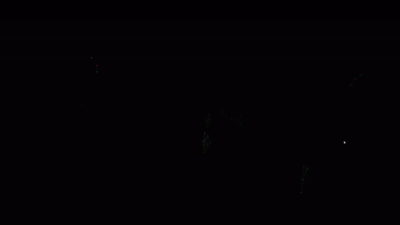

# TGView3D

The TGView3D System is a 3D-theory graph viewer developed at the [KWARC group](http://kwarc.info) at [FAU Erlangen-Nürnberg](http://www.fau.de) in the Unity Engine.

It is intended to be used with VR Hardware to offer an immersive experience of the represented data.
Different layouts and highlighting settings will be developed, which will visualize the complex theory graphs efficiently.

Update: Demo Builds are available now (see Releases)

(Note: this system is in its really early stages. If you want to build the App yourself with Unity you should get the most recent Unity version, pull the vr branch and be prepared to receive a lot of prototype scenes.)

[VR-Demo Video](https://www.youtube.com/watch?v=Mx7HSWD5dwg)

