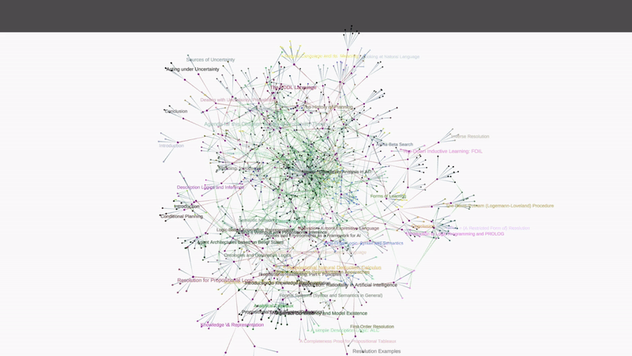
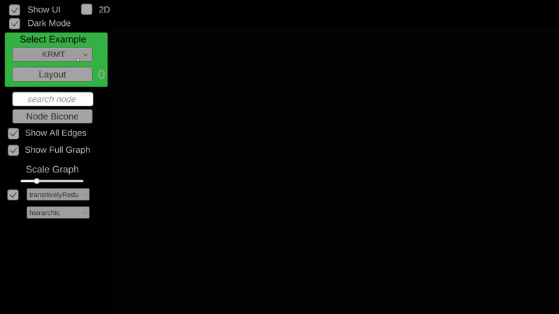
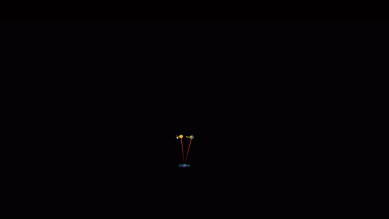

# TGView3D

The TGView3D System is a 3D-theory graph viewer developed at the [KWARC group](http://kwarc.info) at [FAU Erlangen-Nürnberg](http://www.fau.de) in the Unity Engine.
Different layouts and highlighting settings are available, to visualize the complex theory graphs efficiently.

Visit the web version at https://tgview3d.mathhub.info/ 

There is an experimental version that supports VR Hardware to offer an immersive experience of the represented data.

Demo Builds are available now (see Releases)

[VR-Demo Video](https://www.youtube.com/watch?v=Mx7HSWD5dwg)

